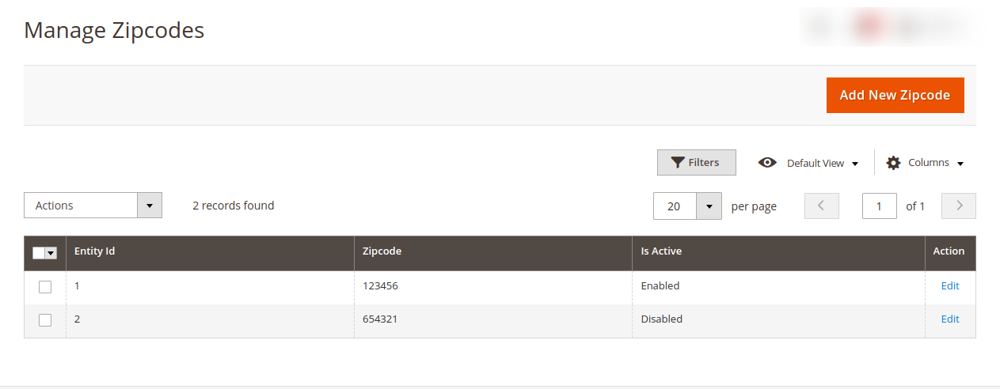
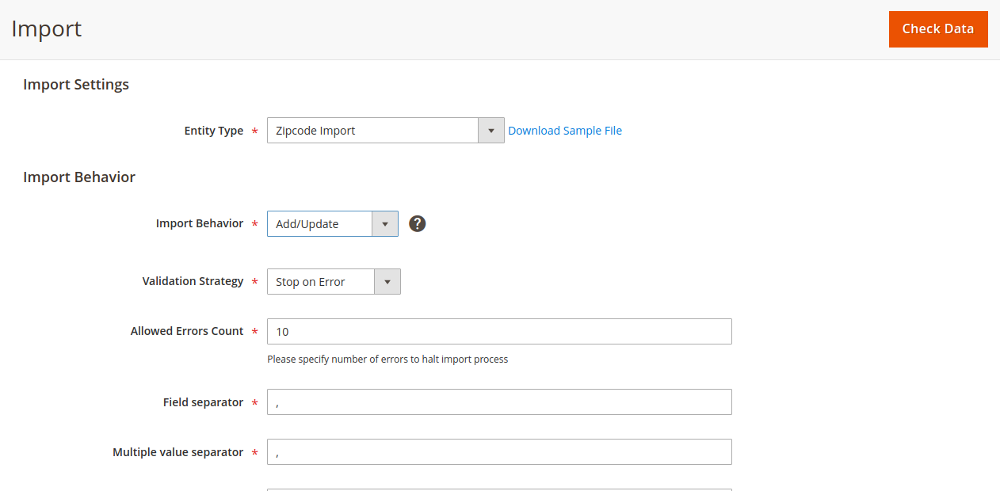

# v4u-magento2-check-delivery-availability
Delivery Availability Checker for Magento 2

## Supports

- <b>Supports : Magento 2.0.x, 2.1.x, 2.2.x, 2.3.x and 2.4.x</b>

Required to run the following commands in Magento 2 root folder:

```
php bin/magento setup:upgrade
php bin/magento setup:static-content:deploy -f
php bin/magento cache:clean
```

### Install via zip

* [Download the latest version from GitHub](https://github.com/vrajeshkpatel/v4u-magento2-check-delivery-availability/archive/master.zip)

## Zip Code available.


## Zip Code not available.


## Admin Product Grid.


## Configuration

Open the Magento 2 Admin Panel and navigate to:
 
 ## Stores > Settings > Configuration > V4U ZIPCHECER > Check Delivery


Manage Zipcode In Admin Panel : 

## Admin Panel-> Zipcode Checker



Import CSV Through Zipcodes

## System -> Data Transfer -> Import -> Zipcode Import



<a href="docs/ZipCode - ZipCode.csv">Sample CSV</a> 
